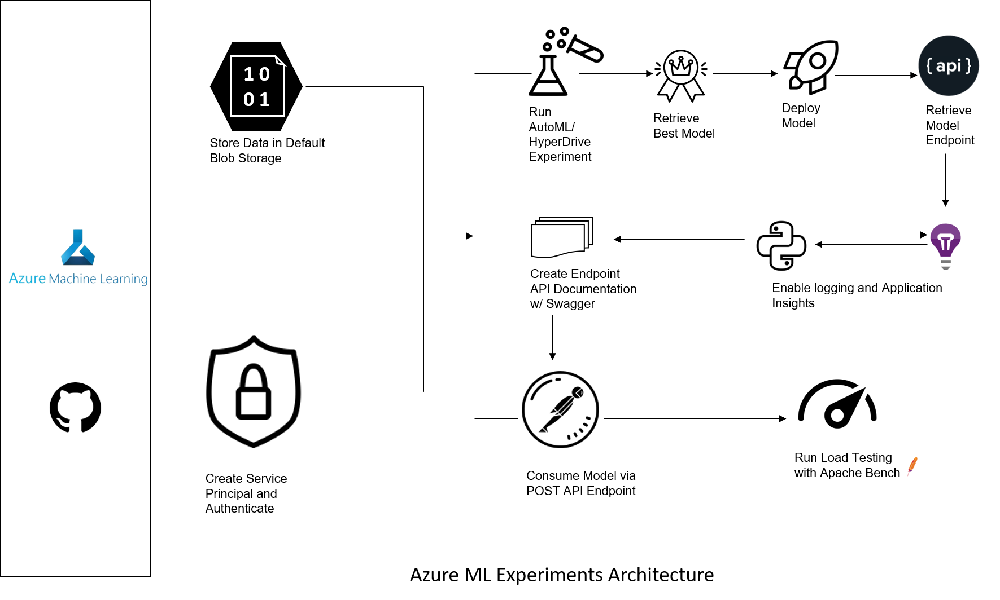
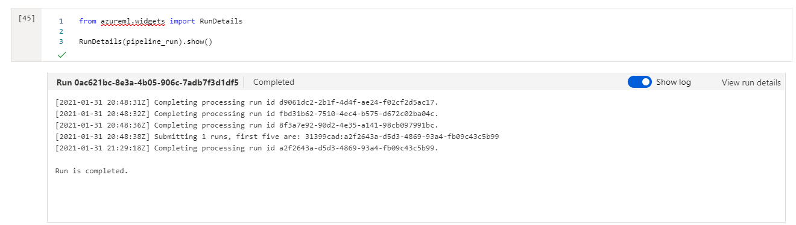
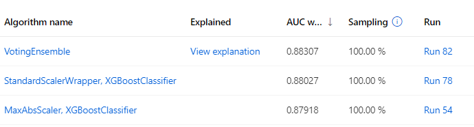
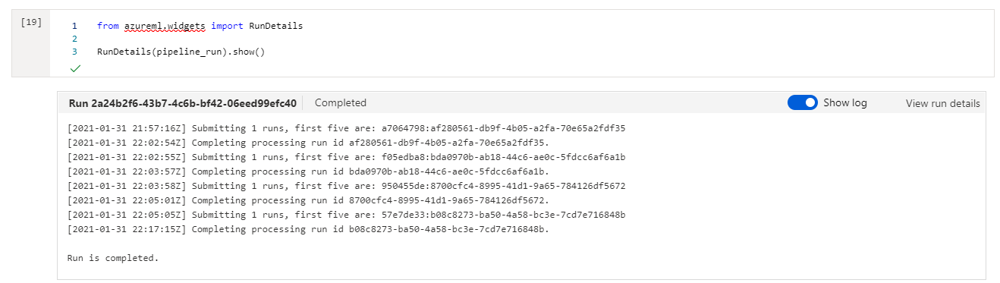
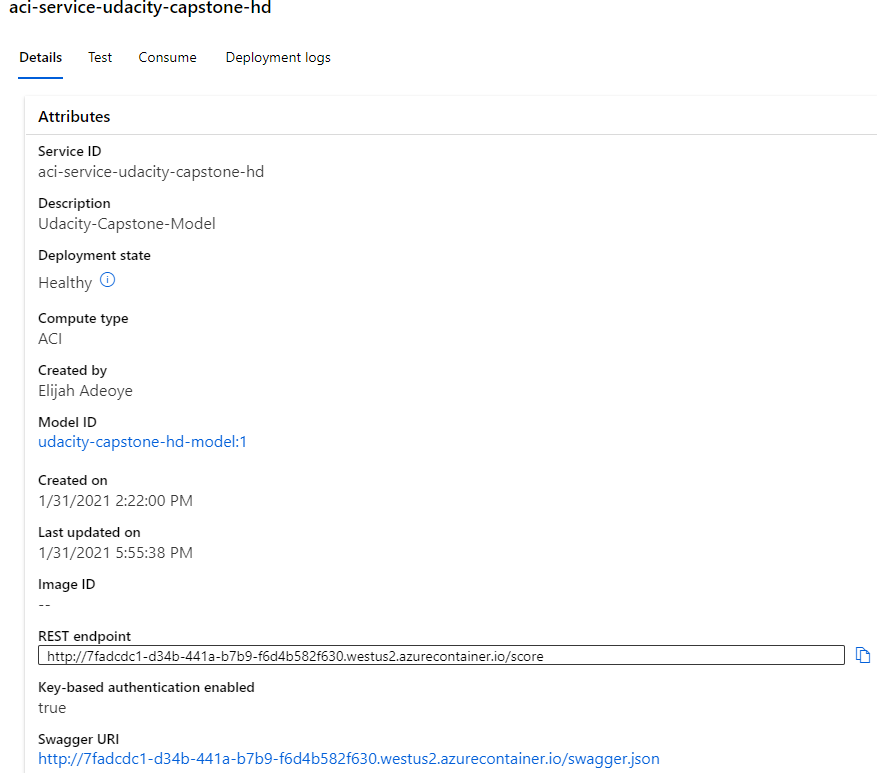
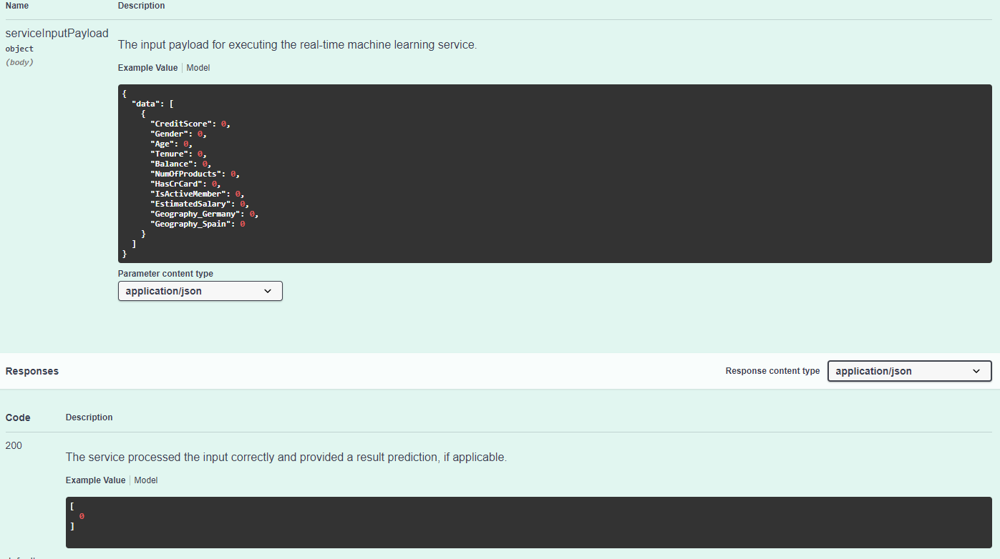
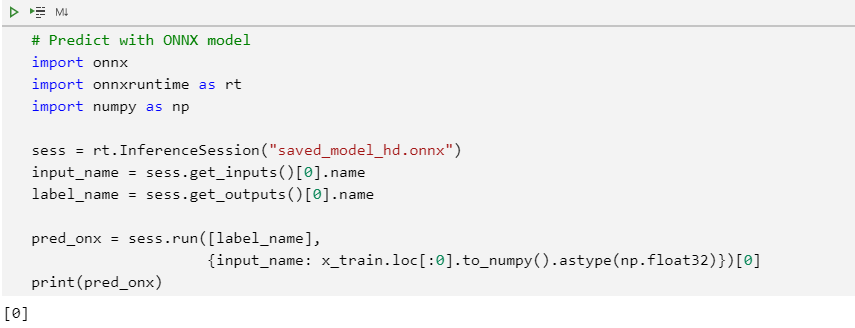
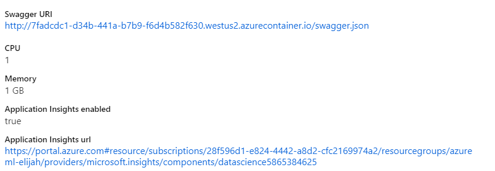
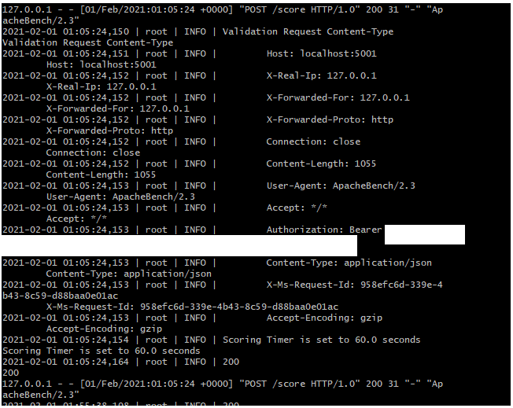
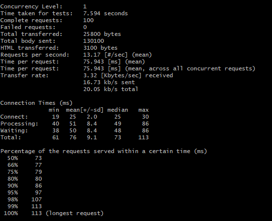

# Building a model to predict bank customer churn with Azure ML

## Project Overview

Our objective is to leverage Azure’s Machine Learning (AML / ML) studio to train a cloud-based machine learning production model with AutoML and HyperDrive, deploy the best model, and retrieve its REST endpoint for consumption. The training data is from a bank with some customer information. Our machine learning goal is to predict if a customer will churn (close their accounts) or not given a set of predictors such as creditscore, geography of origin etc. This, therefore, is a classification problem.

The end product of this process is a reusable REST endpoint / HTTP API endpoint that can be consumed for real time inferencing (scoring). We will also perform load testing with Apache Bench simulating multiple POST requests to the endpoint. This helps us to benchmark our average response time to Azure’s 60 second benchmark and it allows us to check our model endpoint’s health status. Lastly, it is imperative that we wrap our experiments into reusable pipelines with Azure ML pipelines. This approach allows us to automate future predictive modeling via the pipeline’s REST endpoint.  

## Architectural Diagram

**Azure ML Experiments Architecture**  


## Key Actions

### Dataset Retrieval

We will retrieve our bank data from a url, upload to blobstorage, and pass it as a Pipeline Step that is easily re-submitted for future experiments. We will also convert it to a more convenient pandas dataframe using AzureML's "Dataset".

```python
from azureml.core import Dataset
dataUrl = 'https://raw.githubusercontent.com/aniruddhgoteti/Bank-Customer-Churn-Modelling/master/data.csv.csv'

ds = Dataset.Tabular.from_delimited_files(path = dataUrl)
ds = ds.to_pandas_dataframe()
```

</br>

### **Automated ML Experiment**

**AutoML settings**  
We first need to configure our AutoML settings before running our experiment.  
To do so, we will use Azure ML's AutoML config class to configure these settings.

Key highlights:

- We choose to block support vector machines (SVM) due to their generally longer computational times.
- We're setting this as a classification task (to predict customer churn: yes/no)
- Our goal is to "maximize" for AUC_weighted since accuracy could be misleading when dealing with imbalanced datasets
- Once any model hits an AUC of 0.95 within the 30 mins timeframe, we'll exit modeling else we'll pick the best performing model within the given timeout_minute parameter value.

<details><summary>Click to see code block snippet</summary>
<p>

```python
from azureml.train.automl import AutoMLConfig
label = 'Exited' #predicted y_column

# Set parameters for AutoMLConfig

automl_config = AutoMLConfig(
    experiment_timeout_minutes=30,
    blocked_models = ['SVM', 'LinearSVM'],
    task='classification',
    debug_log = 'automl_errors.log',
    primary_metric='AUC_weighted',
    experiment_exit_score = 0.95,
    training_data=output_split_train.parse_parquet_files(),
    label_column_name=label,
    validation_data = output_split_test.parse_parquet_files(),
    # n_cross_validations=10,
    enable_voting_ensemble=True,
    # enable_stack_ensemble=True, #If we want onnx compatible models
    compute_target=aml_compute,
    enable_onnx_compatible_models=True
)
```

</p>
</details>
</br>

**RunDetails widget**  
As part of our pipeline run we will run a RunDetails widget to show step runs with Azure’s Python SDK.


**Best Model**  
Our AutoML best model scored a weighted AUC of approximately 0.883. The best model was an ensemble ("VotingEnsemble"). From visual inspection, the ensemble includes a standard scaler preprocessing step with an XGBoost classifier as one of the key classifiers.  

<pre>
[('datatransformer', DataTransformer(enable_dnn=None, enable_feature_sweeping=None, feature_sweeping_config=None, feature_sweeping_timeout=None, featurization_config=None, force_text_dnn=None, is_cross_validation=None, is_onnx_compatible=None, logger=None, observer=None, task=None, working_dir=None)), ('prefittedsoftvotingclassifier', PreFittedSoftVotingClassifier(classification_labels=None, estimators=[('25', Pipeline(memory=None, steps=[('standardscalerwrapper', ), ('xgboostclassifier', XGBoostClassifier(base_score=0.5, booster='gbtree', colsample_bylevel=1, colsample_bynode=1, colsample_bytree=1, e... min_impurity_decrease=0.0, min_impurity_split=None, min_samples_leaf=0.01, min_samples_split=0.15052631578947367, min_weight_fraction_leaf=0.0, n_estimators=50, n_jobs=1, oob_score=False, random_state=None, verbose=0, warm_start=False))], verbose=False))], flatten_transform=None, weights=[0.4, 0.06666666666666667, 0.2, 0.06666666666666667, 0.06666666666666667, 0.2]))]
</pre>



</br>

### **Azure ML HyperDrive Experiment**

We will be using a gradient boosting library (LGBM) with some default parameters for our HyperDrive experiment.
For sampling, we will use random sampling to traverse our hyperparameter space. This allows us to balance finding the best model with computational performance and cost targets we might have for running experiments.

**HyperDrive settings**  
Key highlights:

We will define an early termnination policy. The BanditPolicy states to check the job every 10 iterations ("evaluation_interval"). If the primary metric for a run after the 10th iteration falls outside of the top 10% range (slack factor), Azure ML will terminate the job. This saves us from continuing to explore hyperparameters that don't show promise of helping reach our target metric. This policy is **first** applied at interval 20 ("delay evaluation")

Here, we want HyperDrive to evaluate number of estimators, learning rate, maximum depth, and subsample for our tree-based light gradient boosted machine (LGBM) model.We also declare default hyperparameters in our train.py.

<details><summary>Click to see code block snippet</summary>
<p>

```python
# Specify parameter sampler
# See here for how to define spaces: https://bit.ly/3o6OAth7
ps = RandomParameterSampling( {
        "--n_estimators": choice(10, 20, 100),
        "--learning_rate": uniform(0.001, 0.1),
        "--max_depth": choice(10, 20, 100),
        "--subsample": uniform(0.1, 1.0)
    }
)

# Specify a Policy | See docs here: https://bit.ly/3hfPGRM
early_termination_policy = BanditPolicy(slack_factor = 0.1, evaluation_interval = 10, delay_evaluation = 20)

est = Estimator(
    source_directory=train_model_folder,
    compute_target=aml_compute,
    entry_script="train.py",
    environment_definition=sklearn_env
)
  
# Create a HyperDriveConfig using the estimator, hyperparameter sampler, and policy.
hyperdrive_config = HyperDriveConfig(estimator=est,
                                        policy=early_termination_policy,
                                        hyperparameter_sampling=ps, 
                                        primary_metric_name="AUC_weighted",
                                        primary_metric_goal=PrimaryMetricGoal.MAXIMIZE,
                                        max_total_runs=20, 
                                        max_concurrent_runs=4)
```

</p>
</details>
</br>

**RunDetails widget**  
As part of our pipeline run we will run a RunDetails widget to show step runs with Azure’s Python SDK.


**Best model and hyperparameters**  
The best LGBM model scored a weighted AUC of 0.900 (making it our best model for this classification task)
Below are the best model's' hyperparameters:

<pre>
LGBMClassifier(boosting_type='gbdt', class_weight=None, colsample_bytree=1.0,
               importance_type='split', learning_rate=0.05138822182057585,
               max_depth=20, min_child_samples=20, min_child_weight=0.001,
               min_split_gain=0.0, n_estimators=10, n_jobs=-1, num_leaves=31,
               objective=None, random_state=None, reg_alpha=0.0, reg_lambda=0.0,
               silent=True, subsample=0.9358133613033942,
               subsample_for_bin=200000, subsample_freq=0)
</pre>


</br>

### **Deploying the best model**

We will deploy the best model (LGBM from HyperDrive model) and consume that model’s endpoint via an HTTP REST API. Below we see the endpoint as both deployed and active (or Deployment State: "Healthy").



</br>

**Instructions on scoring with the deployed model endpoint**  
To score new data with the model endpoint, we need to pass in an authentication key and wrap our data into a json format. This is the format the model expects. See swagger documentation snapshot below for example input and output.  

<details><summary>Click to see code block snippet</summary>
<p>

``` python
import requests
import json

scoring_uri = aci_service.scoring_uri
headers = {'Content-Type':'application/json'}
if aci_service.auth_enabled:
    headers['Authorization'] = 'Bearer '+ aci_service.get_keys()[0] #Get primary key
elif aci_service.token_auth_enabled:
    headers['Authorization'] = 'Bearer '+ aci_service.get_token()[0]
# Take four records
X_train_uri_sub = x_train.loc[0:5]  
X_train_json = X_train_uri_sub.to_json(orient='records')
data = "{\"data\": " + X_train_json +"}"

```

</p>
</details>
</br>

Swagger documentation demonstrating sample expected input and output for model endpoint consumption. Swagger allows for quick documentation of our model’s REST API. We are able to view the appropriate GET and POST endpoints as well as the expected data structure in JSON format.  


</br>

## Standout suggestions

### Convert model to ONNX format and score

We convert our model to ONNX format and use it to score data.  


### Enable App Insights

**Endpoints section in Azure ML Studio, showing that “Application Insights enabled” says “true”. App Insights allow us to visually examine the health of our deployed endpoint.**  


### Enable logging

Logging is a necessary step in this process as it allows us to detect performance issues, or “anomalies”, with our deployed model and it shows us errors as they occur.

**Logging is enabled by running the provided logs.py script**  


**Apache Benchmark (ab) runs against the HTTP API using authentication keys to retrieve performance results. We ran 100 requests against our benchmark. Performance excels well beneath the 60 second mark at ~ 76ms per request.**  


## Future Considerations

To improve our project in the future we will continue to heavily focus on complete end-to-end automation by:

1. Adopting an infrastructure-as-code (IAC) tenet where training, continuous experimentation, and scoring are completely executed via code.
2. Scheduling our experiment pipelines to run based on a set recurring schedule and based on updates to our training data.
3. Creating a new ML pipeline for batch scoring that is connected to our training pipeline.
4. Automatically monitoring data drift.
5. Leveraging Azure DevOps / Azure Pipelines to provision this end-to-end machine learning (ML) strategy.

Our main goal is to eventually operationalize ML, for training and scoring, as a continuous integration / continuous delivery and deployment (CI/CD) process.  

## Screen Recording

[Screencast Link](https://youtu.be/nJ-aVPpRPXE)
